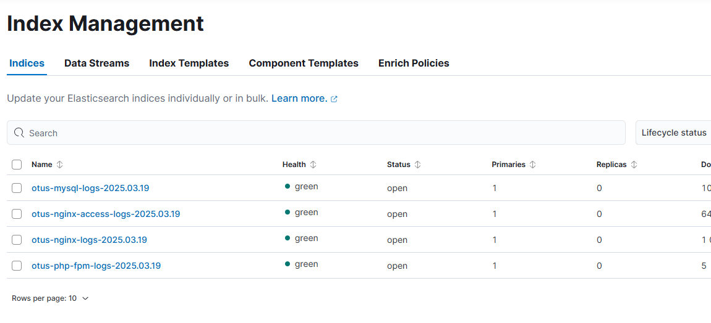
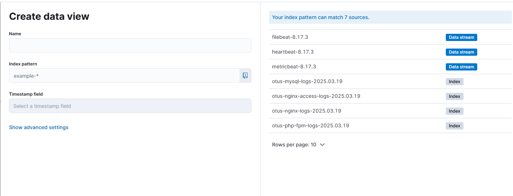
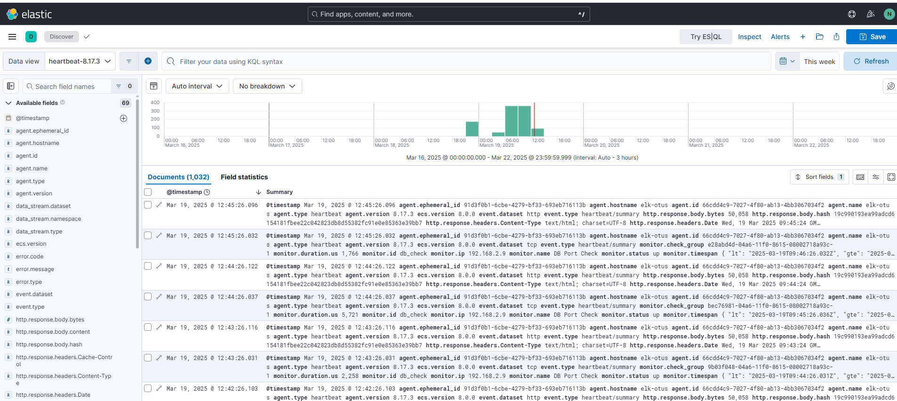
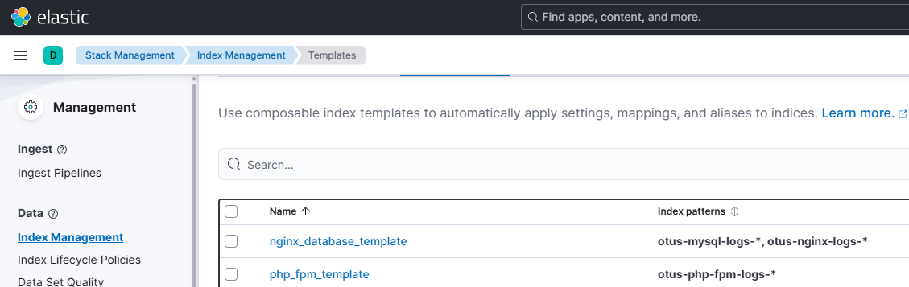
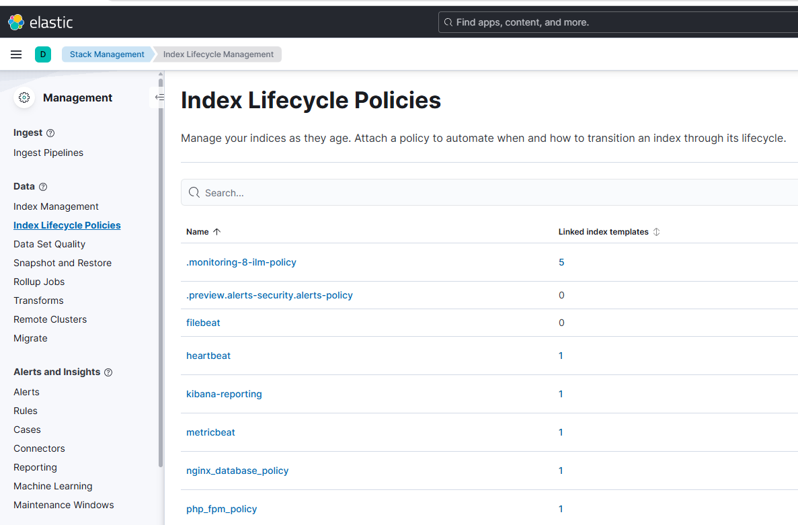
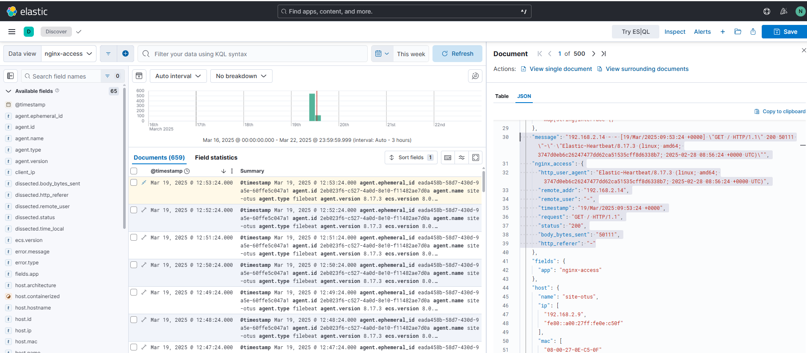

# Otus-2024 ELK-1
## Beats - инструменты доставки данных

---

## **1. Установка и настройка hearthbeat, filebeat, metricbeat, elasticsearch и kibana**

### Шаг 1: Добавление зеркало репозитория yandex на VM
```bash
deb [trusted=yes allow-insecure=yes] https://mirror.yandex.ru/mirrors/elastic/8/ stable main
```
### Шаг 2: Добавляем ключ репозитория
```bash
apt-key adv --keyserver keyserver.ubuntu.com --recv-keys D27D666CD88E42B4
apt-key export D88E42B4 | gpg --dearmour -o /etc/apt/trusted.gpg.d/elk.gpg
```

### Шаг 3: Устанвливаем необходимое ПО
```bash
apt-get install filebeat metricbeat heartbeat-elastic elasticsearch kibana
```

### Шаг 4: Запускаем службы и проверяем, что они запустились (systemctl и journalctl)

### Шаг 5: Редактируем конфиги служб и перезапускаем их
Обратить внимание, что elasticsearch и kibana по умолчанию запускается на локальном интервейсе (localhost)

### Шаг 6: Если все верно настроено, то должны увидите в интерфейсе kibana появление Index

Если репликаци отсутствует применить правило, чтоб индексы не светились желтыми)))

### Шаг 7: Добавляем Data Views


### Шаг 8: Проверяем, что логи присутствуют


## **Задания со звездочкой**

### Шаг 1: Добавляем политики хранения
```bash
PUT _ilm/policy/nginx_database_policy
{
  "policy": {
    "phases": {
      "hot": {
        "actions": {
          "rollover": {
            "max_age": "30d"
          }
        }
      },
      "delete": {
        "min_age": "30d",
        "actions": {
          "delete": {}
        }
      }
    }
  }
}
```
```bash
PUT _ilm/policy/php_fpm_policy
{
  "policy": {
    "phases": {
      "hot": {
        "actions": {
          "rollover": {
            "max_age": "14d"
          }
        }
      },
      "delete": {
        "min_age": "14d",
        "actions": {
          "delete": {}
        }
      }
    }
  }
}
```
### Шаг 2: Создаем шаблоны и подключаем к ним политики хранения



### Шаг 3: Настройте в filebeat dissect для логов nginx, так чтобы он переводил access логи в json
Проверяем какой формат лога у nginx(для настройки парсинга и конфвертации в json)
Добавляем в конфиг. файл filebeat.yml раздел обработки:
```bash
json.keys_under_root: true
json.add_error_key: true
processors:
  - dissect:
      tokenizer: "%{remote_addr} - %{remote_user} [%{+timestamp}] \"%{request}\" %{status} %{body_bytes_sent} \"%{http_referer}\" \"%{http_user_agent}\""
      field: "message"
      target_prefix: "nginx_access"
  - timestamp:
      field: "nginx_access.timestamp"
      layouts:
        - "02/Jan/2006:15:04:05 +0000"  # Формат времени в логе
      test:
        - "10/Oct/2023:14:55:36 +0000"
  - add_fields:
      fields:
        app: nginx-access
```
Проверяем, что логи идут в нужном формате:

