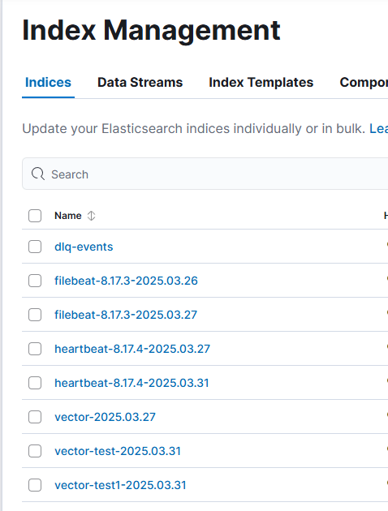
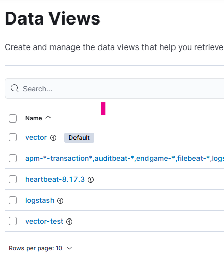
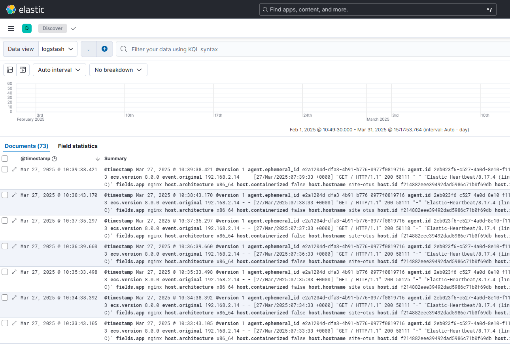
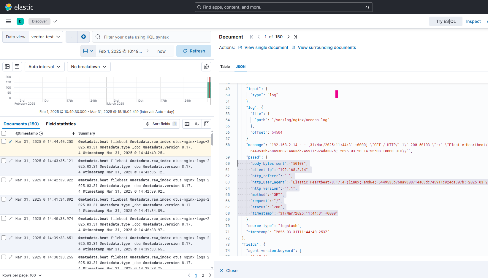

# Otus-2024 ELK-2
## Системы агрегации сообщений Logstash/Vector
---

## **1. Установка и настройка logstash и vector**

### Шаг 1: Добавление зеркало репозитория yandex на VM
```bash
deb [trusted=yes allow-insecure=yes] https://mirror.yandex.ru/mirrors/elastic/8/ stable main
```
### Шаг 2: Добавляем ключ репозитория
```bash
apt-key adv --keyserver keyserver.ubuntu.com --recv-keys D27D666CD88E42B4
apt-key export D88E42B4 | gpg --dearmour -o /etc/apt/trusted.gpg.d/elk.gpg
```

### Шаг 3: Устанвливаем необходимое ПО
```bash
apt-get install logstash
curl -1sLf 'https://repositories.timber.io/public/vector/cfg/setup/bash.deb.sh' | sudo -E bash
apt-get install vector
```

### Шаг 4: Запускаем службы и проверяем, что они запустились (systemctl и journalctl)

### Шаг 5: Редактируем конфиги служб и перезапускаем их
### Шаг 6: Если все верно настроено, то должны увидите в интерфейсе kibana появление Index

Если репликаци отсутствует применить правило, чтоб индексы не светились желтыми)))

### Шаг 7: Добавляем Data Views


### Шаг 8: Проверяем, что логи присутствуют



## Задание со звездочкой
Настройка Dead Letter Queue (DLQ) в Logstash позволяет обрабатывать и управлять событиями, которые не удалось обработать из-за ошибок в конфигурации, плагинах или данных. DLQ служит своего рода «страховочной сеткой», куда направляются ошибочные события.

### 1. Убедитесь, что версия Logstash поддерживает DLQ
Dead Letter Queue была представлена в Logstash начиная с версии 5.5. Проверьте текущую версию Logstash:

logstash --version
Если версия Logstash ниже 5.5, обновите Logstash, чтобы использовать эту функцию.

### 2. Активируйте DLQ в конфигурационном файле Logstash
Dead Letter Queue можно включить через настройку pipeline в конфигурационном файле Logstash. Измените или создайте файл logstash.yml (обычно находится в /etc/logstash/logstash.yml, но путь может варьироваться в зависимости от системы). Добавьте или измените следующие строки:
```bash
# Включение Dead Letter Queue
dead_letter_queue.enable: true

# Максимальный размер очереди для хранения ошибочных событий (в байтах)
dead_letter_queue.max_bytes: 10mb

# Путь к каталогу хранения DLQ-файлов
path.dead_letter_queue: /var/lib/logstash/dead_letter_queue
dead_letter_queue.enable: true — активирует очередь DLQ.
dead_letter_queue.max_bytes — устанавливает общий лимит памяти для DLQ (по умолчанию 1 ГБ).
path.dead_letter_queue — задает директорию для хранения файлов DLQ. Проверьте разрешения на доступ.
```
### 3. Настройка плагина output для отправки событий в DLQ
Некоторые Logstash плагины (например, elasticsearch output) поддерживают автоматическое направление событий в DLQ, если они не могут быть успешно обработаны. Вам нужно настроить этот процесс с помощью соответствующего параметра.

Пример конфигурации для плагина elasticsearch в файле pipeline, например, logstash.conf:
```bash
output {
  elasticsearch {
    hosts => ["http://localhost:9200"]
    index => "example-index"
    document_id => "%{id}"
    # Включение DLQ для ошибок в elasticsearch output
    dead_letter_queue.enable => true
  }
}
```
Здесь вы явным образом активируете DLQ для плагина elasticsearch. Теперь любые неисправленные ошибки отправляются в DLQ, а не просто игнорируются.

### 4. Считывание событий из DLQ
Чтобы классифицировать и обрабатывать события из DLQ, можно настроить отдельный pipeline Logstash, который будет считывать эти события из DLQ и направлять их в другие хранилища для анализа.

Пример конфигурации:
```bash
input {
  dead_letter_queue {
    path => "/var/lib/logstash/dead_letter_queue"
    commit_offsets => true # Указывает Logstash отмечать обработанные записи как "прочитанные"
  }
}

filter {
  # Обработка событий из DLQ (например, диагностика причин ошибки)
  ruby {
    code => 'event.set("dlq_reason", event.get("logstash.dead_letter_queue.reason"))'
  }
}

output {
  # Отправить события из DLQ в Elasticsearch для диагностики
  elasticsearch {
    hosts => ["http://localhost:9200"]
    index => "dlq-events"
  }

  # Либо записать их в отдельный лог-файл
  file {
    path => "/var/log/logstash/dlq/dlq.log"
  }
}
```
Объяснение конфигурации:

Плагин dead_letter_queue в разделе input читает из директории, указанной в path.dead_letter_queue.
В разделе filter мы используем фильтр ruby, чтобы извлечь причину ошибки (поле logstash.dead_letter_queue.reason).
События отправляются в Elasticsearch (или могут быть записаны в локальный файл).
### 5. Проверка и диагностика DLQ
После запуска Logstash вы можете проверить содержимое папки DLQ, которая была указана в path.dead_letter_queue. Файлы DLQ содержат ошибочные события, которые могут быть прочитаны только с помощью Logstash или специальных утилит.

Также вы можете проверить статус DLQ с помощью логов Logstash:

tail -f /var/log/logstash/logstash-plain.log
Или, если вы используете systemd, выполните:
journalctl -u logstash

Logstash предоставляет возможность настройки Policy-based Index Lifecycle Management (ILM) при отправке данных в Elasticsearch. Политики ILM позволяют автоматизировать управление жизненным циклом индексов, чтобы эффективно справляться с ростом данных, оптимизировать использование ресурсов и контролировать удаление устаревших данных.
Ниже предоставляется пошаговое руководство по настройке ILM для Logstash при отправке данных в Elasticsearch.

### 1. Требования
Перед настройкой ILM, убедитесь в следующем:

Elasticsearch версии 6.6 или выше (ILM был внедрен с этой версии).
Logstash версии 7.x и выше.
Доступ к правам суперпользователя в Elasticsearch для создания ILM-политики.

### 2. Создание политики ILM в Elasticsearch
Сначала создайте саму политику ILM. Политики ILM определяют этапы жизненного цикла данных: hot (горячий), warm (теплый), cold (холодный), delete (удаление).
Пример запроса для создания политики my_ilm_policy (вы можете использовать Kibana Dev Tools или вызвать запрос через curl):
```bash
PUT _ilm/policy/my_ilm_policy
{
  "policy": {
    "phases": {
      "hot": {
        "min_age": "0ms",
        "actions": {
          "rollover": {
            "max_size": "50gb",
            "max_age": "30d"
          },
          "set_priority": {
            "priority": 100
          }
        }
      },
      "warm": {
        "min_age": "30d",
        "actions": {
          "shrink": {
            "number_of_shards": 1
          },
          "set_priority": {
            "priority": 50
          }
        }
      },
      "delete": {
        "min_age": "90d",
        "actions": {
          "delete": {}
        }
      }
    }
  }
}
```
Пример политики:
Переключает индекс в горячую фазу сразу после его создания.
Выполняет rollover через 30 дней или при достижении размера индекса 50 GB.
После 30 дней данные переходят в «теплую» фазу, где уменьшается количество реплик.
Через 90 дней удаляет индексы из кластера.


### 3. Создание шаблона индекса для ILM
Для применения вашего ILM необходимо настроить индексный шаблон, который связывает вашу систему с указанной политикой ILM.
Пример настройки индексного шаблона:
```bash
PUT _index_template/my_template
{
  "index_patterns": ["logstash-*"],
  "data_stream": { },
  "template": {
    "settings": {
      "index.lifecycle.name": "my_ilm_policy",
      "index.lifecycle.rollover_alias": "logstash-alias"
    }
  }
}
```

index_patterns: Маска для индексов (например, все индексы Logstash, начинающиеся с logstash-*).
index.lifecycle.name: Имя ILM политики.
rollover_alias: Алиас, связанный с индексами для выполнения операции rollover. Имейте в виду, что индексы должны быть частью алиаса для ILM, чтобы работать.

### 4. Настройка Logstash для ILM
Для того чтобы Logstash создавал индексы с заданной политикой ILM, необходимо изменить output в конфигурации Logstash.
Пример конфигурации Logstash (logstash.conf):
```bash
output {
  elasticsearch {
    hosts => ["http://localhost:9200"]
    index => "%{[@metadata][index_prefix]}-%{+yyyy.MM.dd}"
    ilm_enabled => true
    ilm_rollover_alias => "logstash-alias"
    ilm_policy => "my_ilm_policy"
    manage_template => false
  }
}
```
ilm_enabled: Включает поддержку ILM в Logstash.
ilm_rollover_alias: Указывает на алиас индекса, который используется политикой ILM.
ilm_policy: Указывает имя политики ILM, которую нужно применить.
manage_template: Выключает автоматическое управление шаблонами Logstash (так как мы создали свой шаблон заранее).

Обратите внимание, что имя алиаса (logstash-alias) должно совпадать с алиасом, указанным в шаблоне индекса.

### 5. Протестируйте настройку

Запустите Logstash и отправьте несколько сообщений в Elasticsearch.

Убедитесь, что создается новый индекс с правильным алиасом. Проверьте алиас командой:
GET _cat/aliases?v

Убедитесь, что настройка ILM применяется. Проверить состояние индекса можно командой:
GET logstash-*/_ilm/explain

Вы должны увидеть текущую фазу ILM для индекса.

### 6. Дополнительные проверки

Если индексы не создаются правильно, проверьте, активирована ли политика в Elasticsearch (GET _ilm/policy).

Убедитесь, что алиас (logstash-alias) указывает на правильный индекс:
GET _alias/logstash-alias
