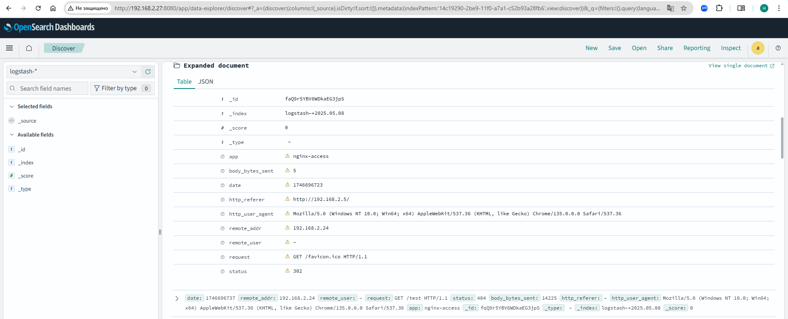
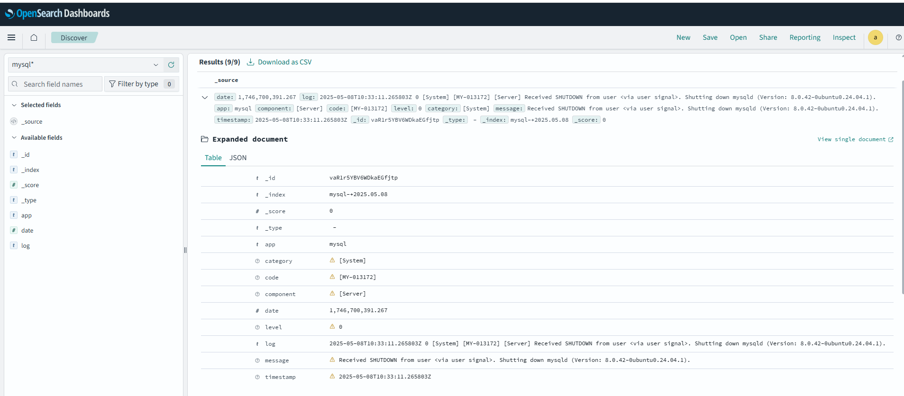

# Otus-2024 FDO
## Opensearch
---

### Шаг 1: Устанавливаем fluen-bit
```
curl https://raw.githubusercontent.com/fluent/fluent-bit/master/install.sh | sh
```
### Шаг 2: Устанавливаем opensearch-data-prepper
Скачиваем исходники с репозитория
Собираем из исходников
Создаем и добавляем сервис
### Шаг 3: Opensearch и Opensearch-dashboard
Скачиваем deb пакеты и устанавливаем их через apt
### Шаг 4: Конфигурим службы и перезапускаем

### Проверка


