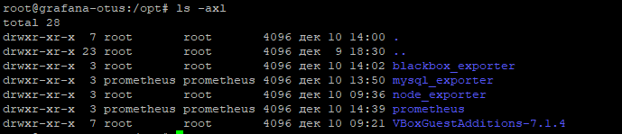
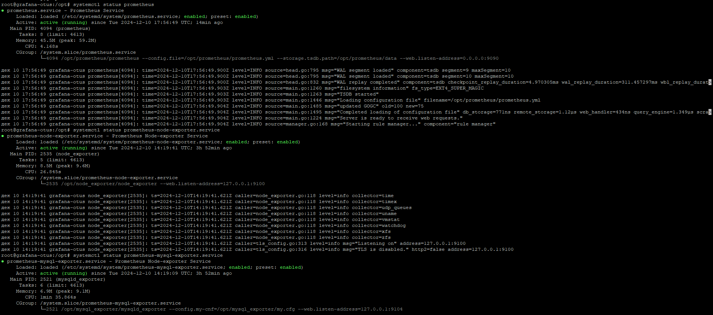
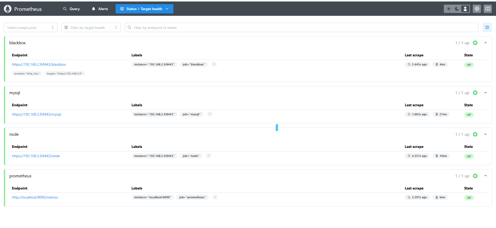

# Otus-2024 HW3
## Observability: мониторинг, логирование, трейсинг
### Подготовка окружения к ДЗ.
1) Устанавливаем VirtualBox
2) Устанавливаем Ubuntu
3) [Установка WP](/docs/install-wordpress.md)
## Настройка prometheus и exporter
### Скачиваем:
* wget https://github.com/prometheus/prometheus/releases/download/v3.0.1/prometheus-3.0.1.linux-amd64.tar.gz
* wget https://github.com/prometheus/mysqld_exporter/releases/download/v0.16.0/mysqld_exporter-0.16.0.linux-amd64.tar.gz
* wget https://github.com/prometheus/blackbox_exporter/releases/download/v0.25.0/blackbox_exporter-0.25.0.linux-amd64.tar.gz
* wget https://github.com/prometheus/node_exporter/releases/download/v1.8.2/node_exporter-1.8.2.linux-amd64.tar.gz
### Создаем необходимые директории в /opt:

* Распаковываем все архивы по директориям
* Создаем и конфигурируем сервисы
* Запускаем службы
* Проверяем запущеные службы

* Проверяем target в prometheus

### Задание со **
* Запускаем все на локальной интерфейсе 127.0.0.1: добавить в сервис запуска
'--web.listen-address="127.0.0.1:{PORT}"'
* Настраиваем необходимые location в конфиги и добавляем авторизацию по логину и паролю
* создаем самоподписной сертификат и конфигурируем nginx

## Все файлы конфигурации присутствуют в ДЗ
