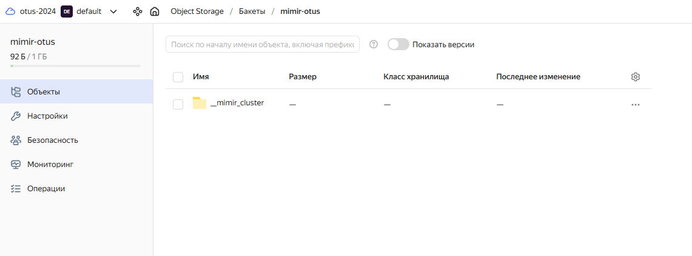
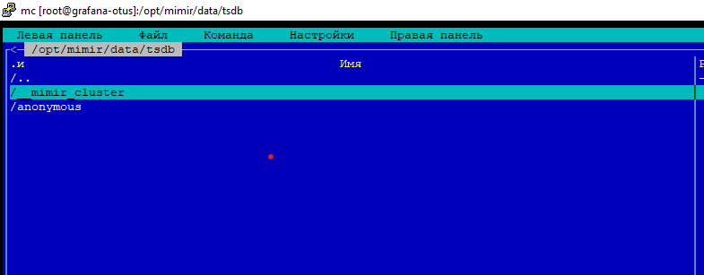
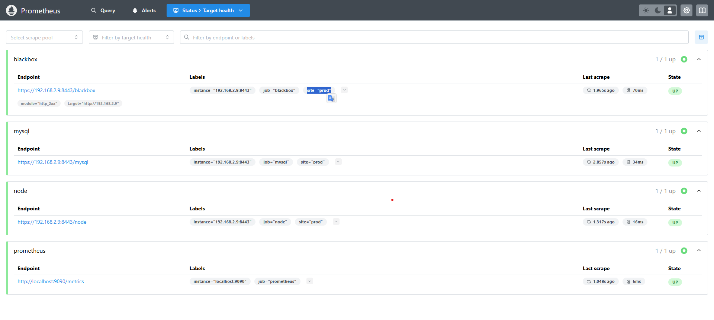
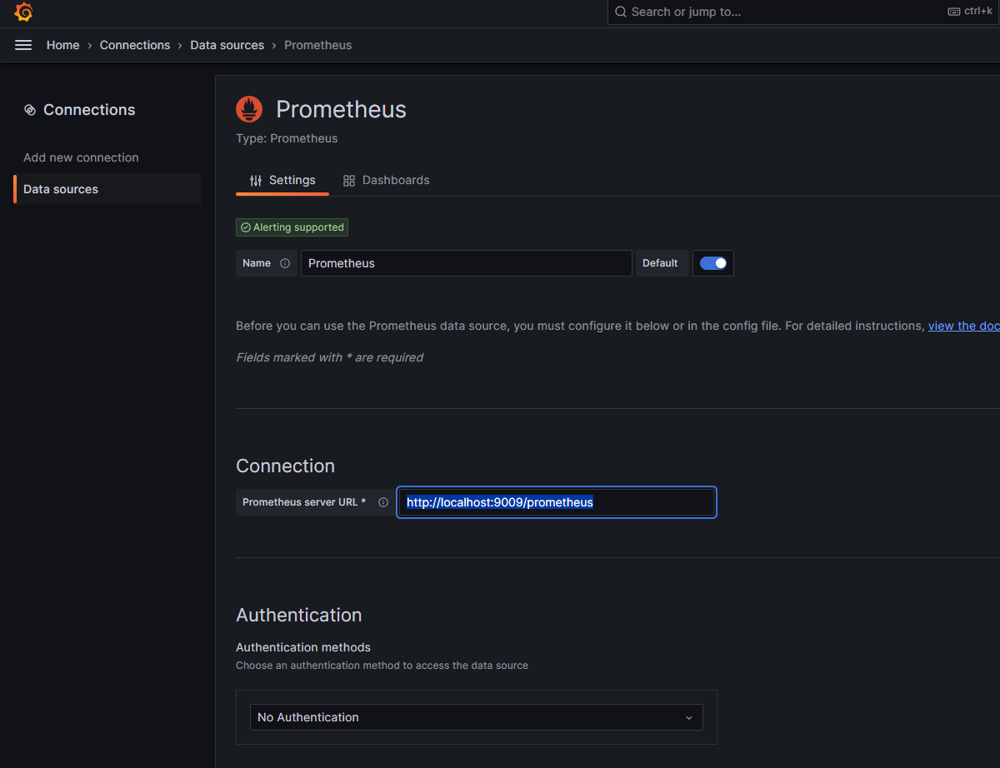
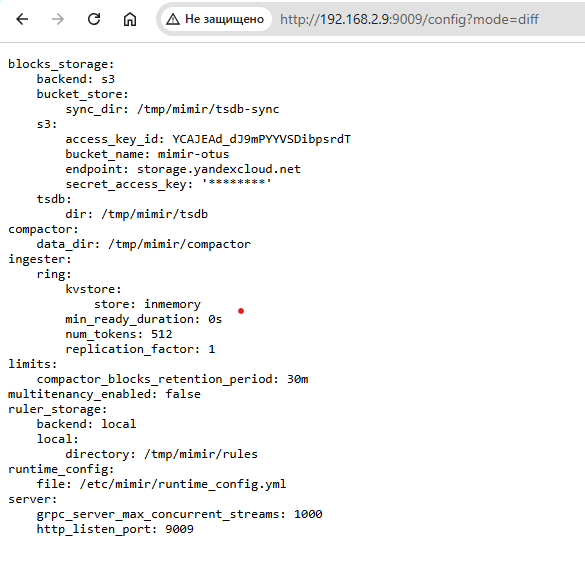
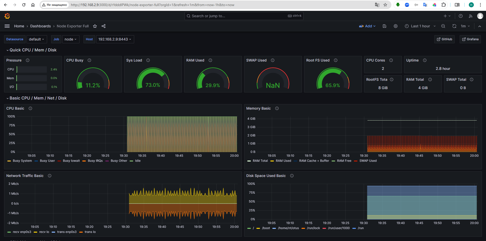
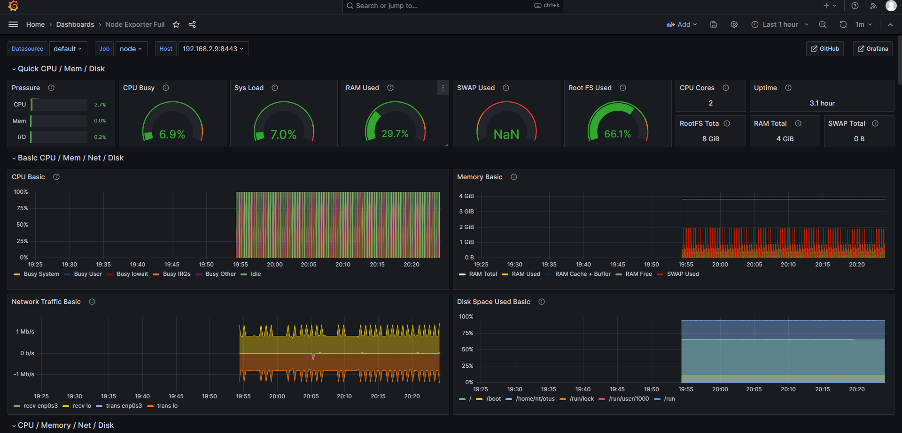

# Otus-2024 HW2
## Отказоустойчивость Prometheus, хранилища метрик для Prometheus (Thanos, VictoriaMetrics, Mimir)

### Подготовка окружения к ДЗ
Переиспользовал виртуальную машину из прошлого занятия.

## Установка Mimir
* Скачиваем необходимые пакеты с [GitHub Releases](https://github.com/grafana/mimir/releases/).
* Устанавливаем их через dpkg.
* Создаем два файла конфигурации: один для тестирования файловой системы (filesystem), другой для проверки S3.

### Результат экспериментов

## Конфигурация Prometheus
* Добавляем в файл `prometheus.yml` секцию `remote_write` (Для записи в mimir).
* Добавляем в файл `prometheus.yml` секцию `relabel_configs` (Для добавление доп. метки).

## Grafana
* Переключаем источник данных на использование Mimir.

## Эксперимент
* Время хранения в Mimir составляет 30 минут.

На графиках в Grafana видно четкую границу в 30 минут.

## Все файлы конфигурации присутствуют в ДЗ
