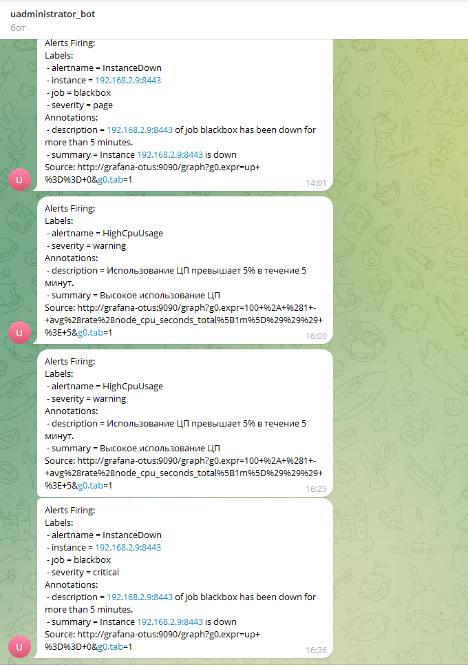

# Otus-2024 GAP-3
## Prometheus, Alertmanager - работа с метриками (PromQL), написание алертов и их ротация

### Подготовка окружения к ДЗ
Переиспользовал виртуальную машину из прошлого занятия.

## Установка Alertmanager
* Скачиваем необходимые пакеты с [GitHub Releases](https://github.com/prometheus/alertmanager/releases/download/v0.27.0/alertmanager-0.27.0.linux-amd64.tar.gz).
* tar xvf alertmanager-0.24.0.linux-amd64.tar.gz
* Конфигурируем файk [alertmanager.yml](alertmanager.yml) c двумя каналами отправки сообщений (email и telegram)
* Создаем файл правил для прометеуса [alertmanager_rules.yml](alertmanager_rules.yml)
* Добавляем в файл [prometheus.yml](prometheus.yml) настройки alertmanager и правил

### Эксперименты

## Все файлы конфигурации присутствуют в ДЗ
