# Otus-2024 GAP-4
## Grafana - Продвинутое Использование

### Подготовка Окружения к ДЗ
В данном задании была переиспользована виртуальная машина из прошлого занятия.

## Установка Плагина для WordPress - PromPress
PromPress позволяет отправлять метрики WordPress в формате Prometheus.
Настраиваем дополнительный target в prometheus.yml

---  
* Не хотелось кликать мышкой все настройки были внесены вручную.
* Включил флаг в конфигурационном файле grafana.ini (provisioning = true). Это дало возможность использовать конфигурацию дашбордов из файлов.  
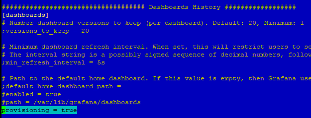  
[Файл конфигурации](dashboards.yaml)  
* Разместил [дерево папок и файлов](dashboards) по пути, указанному в файле (/var/lib/grafana/dashboards):  
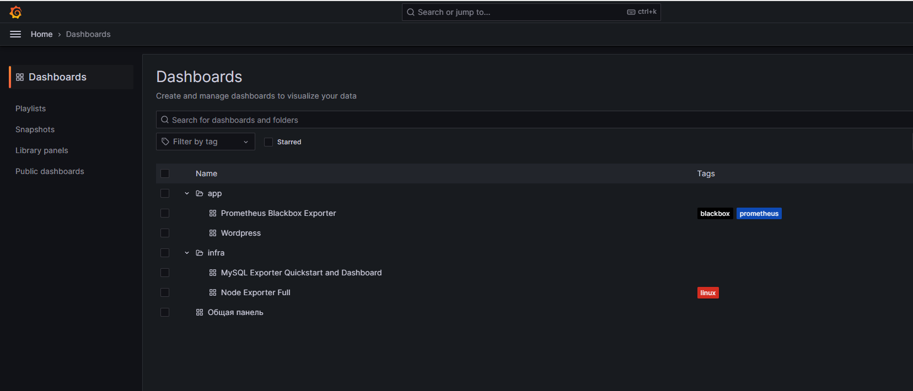  
* Использовал часть стандартных шаблонов с сайта Grafana (Prometheus Blackbox Exporter, MySQL Exporter Quickstart and Dashboard, Node Exporter Full), а также созданные по запросу (WordPress, Общая панель):  
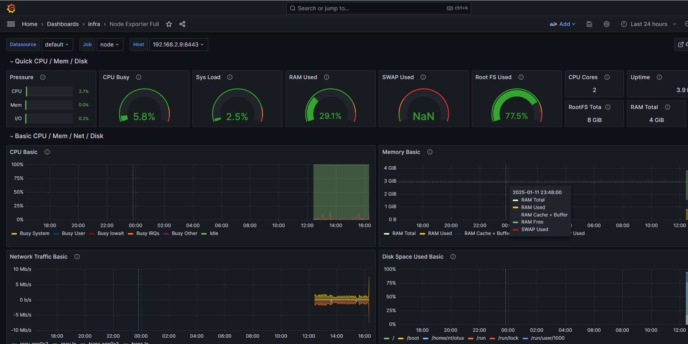  
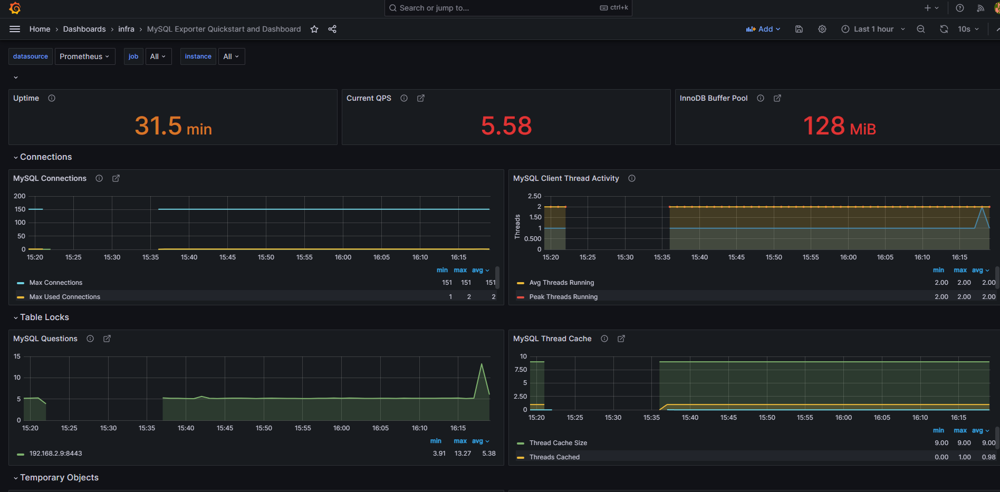  
  
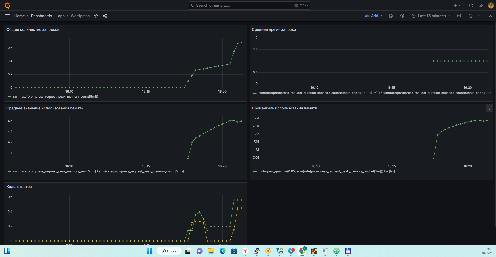  

### Задание со Звездочкой (со **)
* Настроил два канала отправки сообщений в разделе Contact Points: почта и Telegram. Для почты необходимо было включить необходимые настройки в конфигурационном файле grafana.ini:  
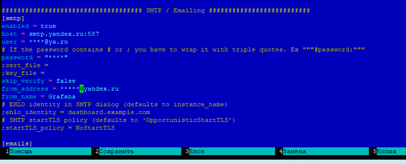  
* Настройка каналов производится через интерфейс Grafana:  
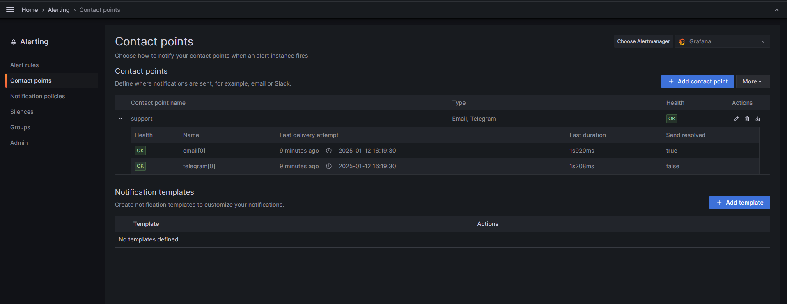  
* Создал правила для событий в разделе Alert Rules:  
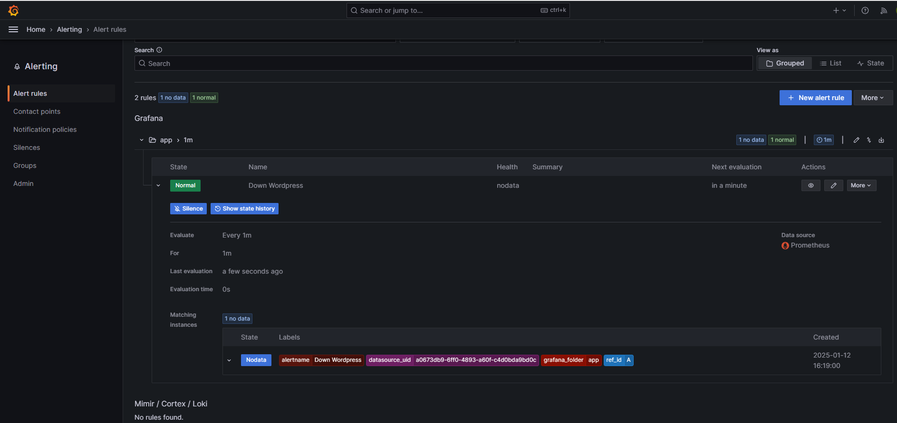  
* Создал правила отправки сообщений в Notification Policies:  
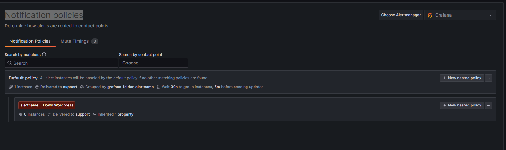  

### Проверка
Когда WordPress перестает корректно отвечать, сообщения отправляются в Telegram и на почту:  
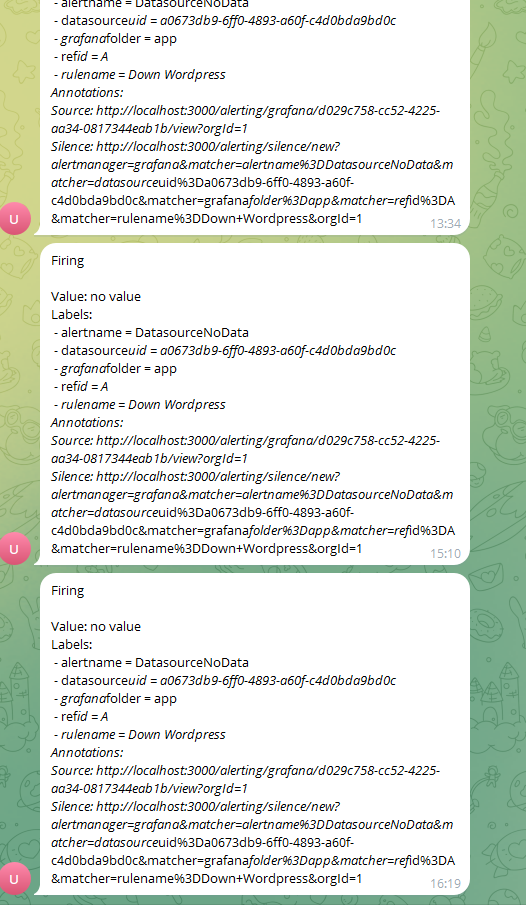  
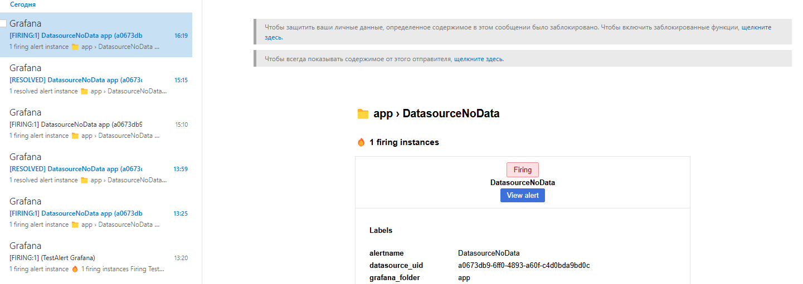  

* Создал дашборд "Общая панель" и связал все панели с соответствующими:  
  
Пример использования линковки:  
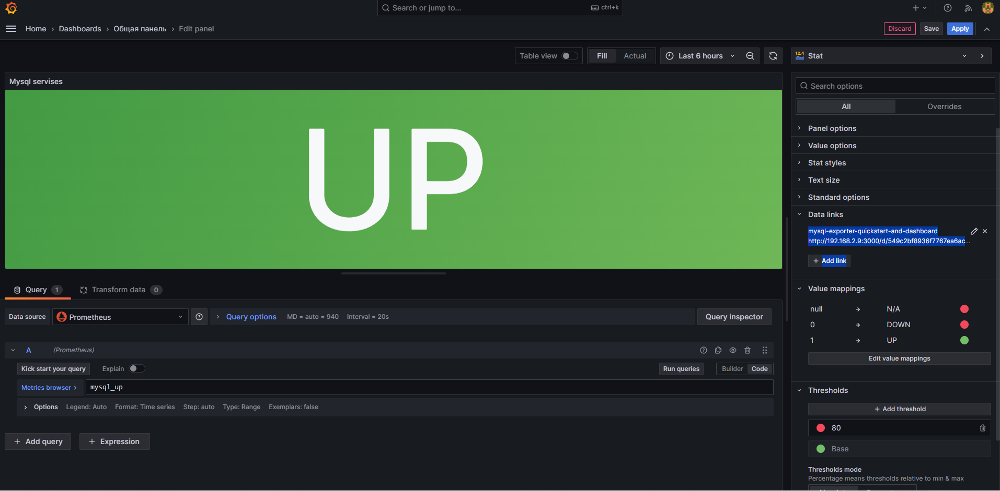  

### Проверка
* Остановил MySQL (все базы данных недоступны, что приводит к недоступности WordPress):  
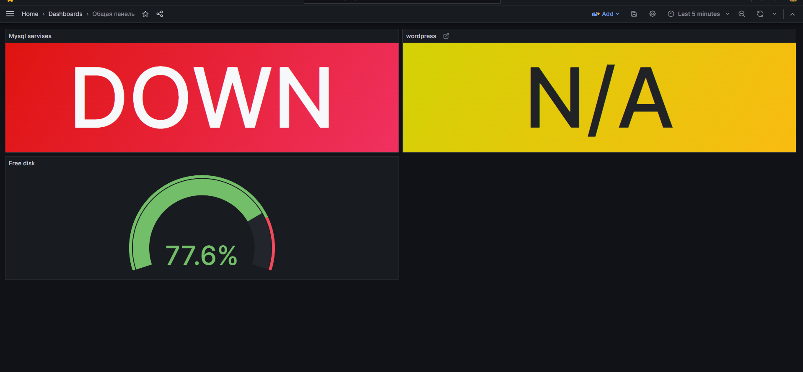  
* Кликаем по панели, переходим в основной раздел - MySQL Exporter Quickstart and Dashboard:  
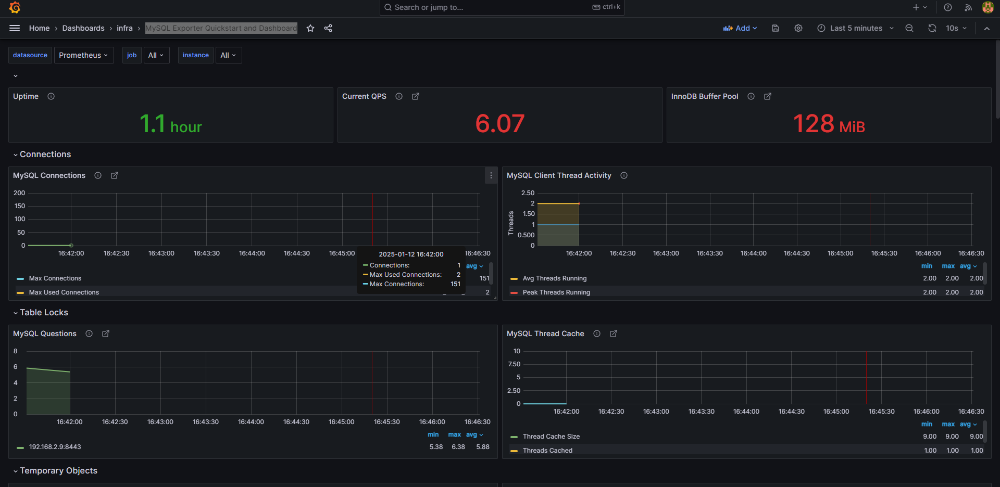  
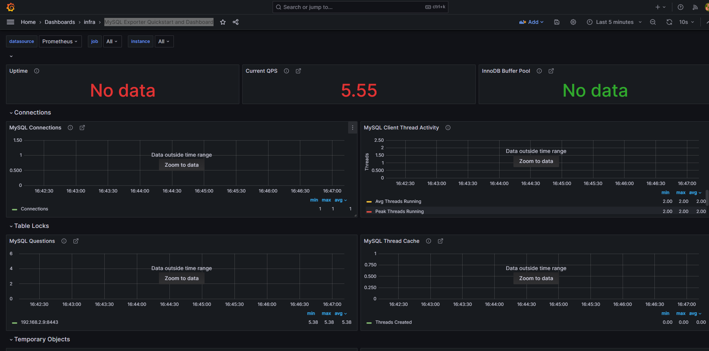  
