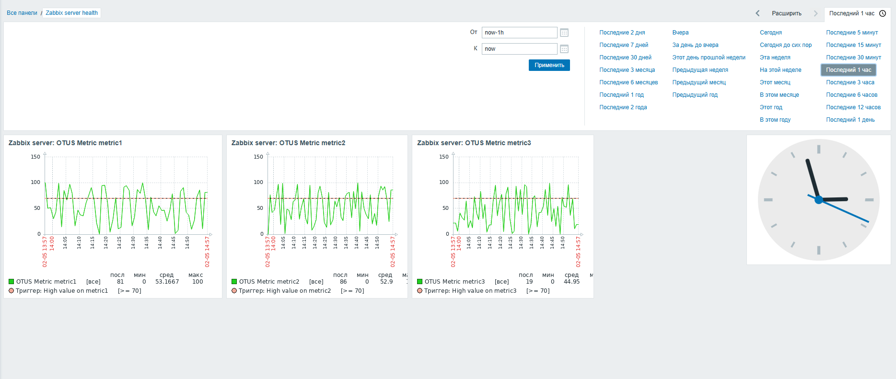
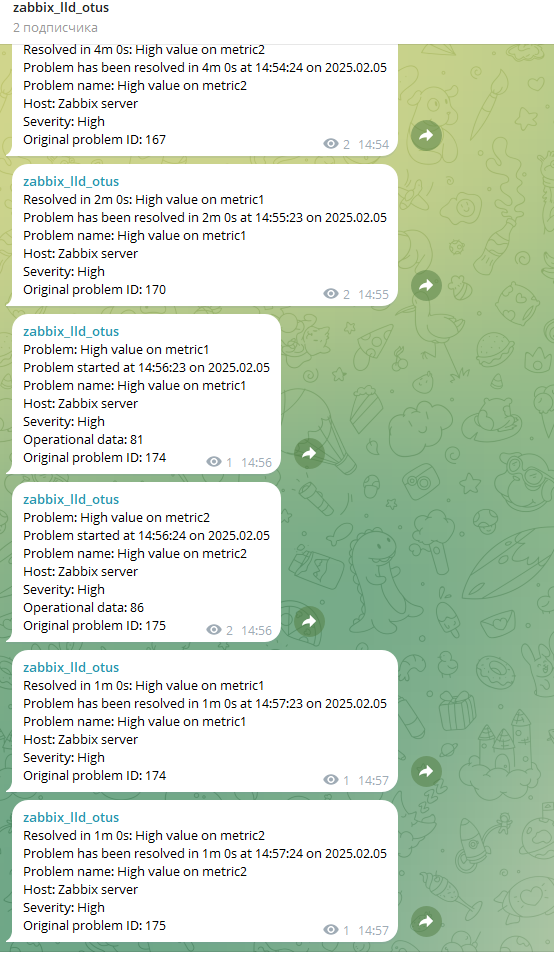

# Otus-2024 GAP-5
## Zabbix - Настройка алертинга

### Подготовка Окружения к ДЗ
В данном задании была переиспользована виртуальная машина из прошлого занятия.

### [Инструкция по установке zabbix 6.x.x](/docs/install-zabbix.md)

### LLD
1. Создание скрипта для генерации метрик
Создайте скрипт, который будет генерировать метрики и возвращать их в формате JSON для LLD.

Пример скрипта (/etc/zabbix/zabbix_agentd.d/scripts/otus_metrics.sh):
```
#!/bin/bash

# Генерация JSON для LLD
if [ "$1" = "discover" ]; then
    echo '{"data":[
        {"{#METRIC}":"metric1"},
        {"{#METRIC}":"metric2"},
        {"{#METRIC}":"metric3"}
    ]}'
else
    # Генерация случайного значения (0-100)
    METRIC=$1
    echo $((RANDOM % 101))
fi
```

2. Настройка Zabbix агента
Добавьте пользовательские параметры в конфигурацию Zabbix агента.

Редактируем файл конфигурации (/etc/zabbix/zabbix_agentd.conf):
```
# LLD для обнаружения метрик
UserParameter=otus.metrics.discover,/etc/zabbix/zabbix_agentd.d/scripts/otus_metrics.sh discover

# Получение значений метрик
UserParameter=otus.metrics[*],/etc/zabbix/zabbix_agentd.d/scripts/otus_metrics.sh "$1"
```

- 3. Создание LLD и триггеров в Zabbix
  - 3.1. Создание шаблона
Перейдите в Configuration → Templates.
Нажмите Create template.
Заполните поля:
Template name: OTUS Important Metrics.
Groups: Выберите группу, например, Templates.
Сохраните шаблон.

  - 3.2. Создание правила LLD
В созданном шаблоне перейдите на вкладку Discovery.
Нажмите Create discovery rule.
Заполните поля:
Name: Discover OTUS Metrics.
Key: otus.metrics.discover.
Update interval: 1m.
Сохраните правило.

  - 3.3. Создание прототипа элементов данных
В правиле LLD перейдите на вкладку Item prototypes.
Нажмите Create item prototype.
Заполните поля:
Name: OTUS Metric {#METRIC}.
Key: otus.metrics["{#METRIC}"].
Type: Zabbix agent.
Type of information: Numeric (unsigned).
Update interval: 1m.
Сохраните прототип.

  - 3.4. Создание прототипа триггера
В правиле LLD перейдите на вкладку Trigger prototypes.
Нажмите Create trigger prototype.
Заполните поля:
Name: High value on {#METRIC}.
Expression:
Нажмите Add и выберите:
Item: OTUS Metric {#METRIC}.
Function: Last().
Operator: >=.
Value: 95.
Выражение будет выглядеть так:
last(/OTUS Important Metrics/otus.metrics["{#METRIC}"]) >= 95.
Severity: Выберите уровень серьезности, например, High.
Сохраните прототип триггера.

- 4. Привязка шаблона к хосту
Перейдите в Configuration → Hosts.
Выберите хост, к которому нужно привязать шаблон.
На вкладке Templates нажмите Select.
Найдите шаблон OTUS Important Metrics и добавьте его.
Сохраните изменения.

- 5. Проверка работы
  - 5.1. Проверка LLD
Перейдите в Monitoring → Latest data.
Выберите хост, к которому привязан шаблон.
Убедитесь, что метрики metric1, metric2, metric3 появились в списке.
Проверьте, что значения метрик обновляются каждую минуту.

  - 5.2. Проверка триггеров
Перейдите в Monitoring → Problems.
Дождитесь, когда значение одной из метрик превысит 95.
Убедитесь, что триггер сработал и отображается в списке проблем.

### Проверка



Телеграмм канал [t.me/otuslldzabbix](https://t.me/otuslldzabbix)
