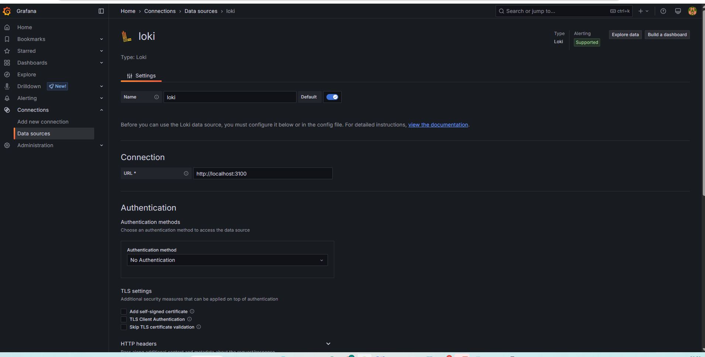
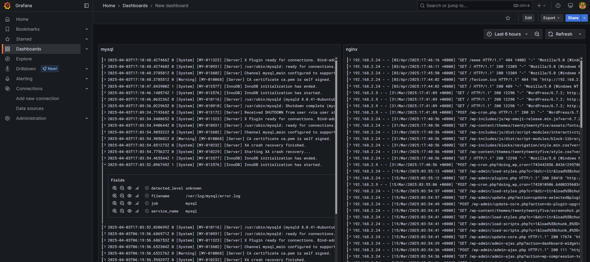

# Otus-2024 Конфигурации Grafana Loki
## Конфигурации Grafana Loki

---

### Шаг 1. Скачиваем и устанавливаем пакет grafana-enterprise_11.6.0 (https://mirrors.huaweicloud.com/grafana/11.6.0/grafana-enterprise_11.6.0_amd64.deb)

### Шаг 2: Устанавливаем loki и promtail (https://github.com/grafana)

### Шаг 3: Конфигурим promtail для забора логов с mysql и nginx. Отправляем их в loki.

### Шаг 4: Запускаем слыжбы и проверяем log на наличие ошибок.

### Шаг 5: Конфигурим Data sources в grafana

### Шаг 6: Настаиваем dashboard в grafana (логи mysql и nginx)

