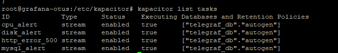

# Otus-2024 TICK-1
## Установка и настройка TICK стека

---

## **1. Установка и настройка InfluxDB**

InfluxDB используется для хранения временных рядов данных.

### Шаг 1: Добавление репозитория и установка InfluxDB
```bash
wget -qO- https://repos.influxdata.com/influxdb.key | sudo apt-key add -
source /etc/os-release
echo "deb https://repos.influxdata.com/${ID} ${VERSION_CODENAME} stable" | sudo tee /etc/apt/sources.list.d/influxdata.list
sudo apt-get update && sudo apt-get install -y influxdb
```

### Шаг 2: Запуск InfluxDB
После установки запустите и включите службу:
```bash
sudo systemctl start influxdb
sudo systemctl enable influxdb
```

### Шаг 3: Проверьте, что InfluxDB работает
Вы можете проверить статус службы:
```bash
sudo systemctl status influxdb
```

### Шаг 4: Настройка InfluxDB (веб-интерфейс или CLI)
- В версии InfluxDB **2.x** используется веб-интерфейс для начальной настройки:
  Откройте интерфейс [http://localhost:8086](http://localhost:8086) и создайте организацию, пространство данных и токен доступа.
- Если установлена версия **1.x**, базу можно настроить через CLI:

```bash
influx
# Создайте базу данных
CREATE DATABASE telegraf_db
```

---

## **2. Установка и настройка Telegraf**

Telegraf — это агент для сбора метрик, который поддерживает множество плагинов входа и выхода.

### Шаг 1: Установка Telegraf
```bash
sudo apt-get install -y telegraf
```

### Шаг 2: Настройка Telegraf
Конфигурационный файл Telegraf находится по пути `/etc/telegraf/telegraf.conf`. Вы можете сгенерировать новый файл с дефолтными параметрами:
```bash
sudo telegraf --config /etc/telegraf/telegraf.conf --input-filter cpu:mem --output-filter influxdb config > /etc/telegraf/telegraf.conf
```

Откройте файл `/etc/telegraf/telegraf.conf` для редактирования:
```bash
sudo nano /etc/telegraf/telegraf.conf
```

- Убедитесь, что вы используете правильный плагин для выхода `[[outputs.influxdb]]`:
```toml
[[outputs.influxdb]]
  urls = ["http://localhost:8086"]
  database = "telegraf_db" # База из шага 4 для InfluxDB
```

- Включите плагины для входа (`inputs`) в зависимости от ваших нужд, например:
```toml
[[inputs.cpu]]
  percpu = true
  totalcpu = true

[[inputs.mem]]
```

### Шаг 3: Запуск и автозагрузка Telegraf
```bash
sudo systemctl start telegraf
sudo systemctl enable telegraf
```

Проверьте статус службы:
```bash
sudo systemctl status telegraf
```

---

## **3. Установка и настройка Chronograf**

Chronograf предоставляет веб-интерфейс для визуализации данных из InfluxDB.

### Шаг 1: Установка Chronograf
```bash
sudo apt-get install -y chronograf
```

### Шаг 2: Запуск Chronograf
```bash
sudo systemctl start chronograf
sudo systemctl enable chronograf
```

### Шаг 3: Доступ к интерфейсу Chronograf
Откройте ваш браузер и перейдите по адресу [http://localhost:8888](http://localhost:8888). При первом запуске вас попросят подключить Chronograf к вашей базе данных InfluxDB.

---

## **4. Установка и настройка Kapacitor**

Kapacitor используется для обработки потоков данных и настройки алертинга.

### Шаг 1: Установка Kapacitor
```bash
sudo apt-get install -y kapacitor
```

### Шаг 2: Настройка подключения к InfluxDB
Откройте файл `/etc/kapacitor/kapacitor.conf`:
```bash
sudo nano /etc/kapacitor/kapacitor.conf
```

Найдите раздел `[influxdb]` и настройте подключения, например:
```toml
[[influxdb]]
  enabled = true
  name = "localhost"
  default = true
  urls = ["http://localhost:8086"]
  username = ""
  password = ""
  insecure-skip-verify = false
```

### Шаг 3: Запуск Kapacitor
```bash
sudo systemctl start kapacitor
sudo systemctl enable kapacitor
```

Вы можете проверить статус:
```bash
sudo systemctl status kapacitor
```

---

## **5. Проверка работы системы**

После настройки всех компонентов вы можете выполнить следующие действия:

1. Убедитесь, что все службы работают корректно:
   ```bash
   sudo systemctl status influxdb
   sudo systemctl status telegraf
   sudo systemctl status chronograf
   sudo systemctl status kapacitor
   ```

2. В Chronograf проверьте подключение к InfluxDB и Kapacitor.

3. Начните сбор данных с помощью Telegraf (например, метрики CPU и памяти) и убедитесь, что данные отображаются в Chronograf.

4. Настройте алертинг в Kapacitor (через TICKscript).


## **6. Включение плагинов telegraf для сбора метрик**
В файле /etc/telegraf/t# Read metrics
```
[[inputs.cpu]]
  percpu = true
  totalcpu = true
  collect_cpu_time = false
  field INCLUDES 'iowait'!
  report_active = false

  core_tags = false
[[inputs.mem]]
[[inputs.disk]]
  ignore_fs = ["tmpfs", "devtmpfs", "devfs"]
[[inputs.net]]
[[inputs.swap]]
[[inputs.mysql]]
  servers = ["telegraf:+++@tcp(127.0.0.1:3306)/"]
[[inputs.procstat]]
  pattern = ".*"
[[inputs.system]]
[[inputs.diskio]]
[[inputs.processes]]

[[inputs.ping]]
  urls = ["8.8.8.8", "192.168.2.1", "192.168.2.9","127.0.0.1"]
  interval = "60s"
  count = 4
  timeout = 2.0
  method = "exec" # или "native" (использует встроенную библиотеку)
  binary = "/bin/ping" # Полный путь к бинарнику ping

[[inputs.nginx]]
  ## URL для доступа к метрикам nginx stub_status
  urls = ["http://127.0.0.1:8080/nginx_status"]

[[inputs.http_response]]
  urls = ["http://192.168.2.9"]
  method = "GET"
  interval = "1m"
  response_timeout = "5s"
  follow_redirects = false
```
Chronograf является одним из инструментов для визуализации данных из Time-Series Database (TSDB), таких как InfluxDB. Это веб-интерфейс для мониторинга, создания запросов и настройки графиков в реальном времени. Ниже представлен пошаговый процесс настройки дашбордов в Chronograf.

---

## **7: Настройка Chronograf**
### **Шаг 1: Подключение Chronograf к InfluxDB**
Chronograf требует подключения к базе данных InfluxDB для получения метрик.

1. В веб-интерфейсе:
   - Зайдите на главную страницу Chronograf.
   - Перейдите на вкладку **"Configuration"** или **"Data Sources"**.
   - Нажмите **"Add a Connection"**.
   - Укажите параметры:
     - **URL** вашей базы данных InfluxDB (например, `http://localhost:8086`).
     - Учетные данные (если есть).
   - Сохраните подключение.

2. Убедитесь, что Chronograf корректно подключился к базе (данные начнут отображаться).

---

### **Шаг 2: Создание нового дашборда**

1. В главном меню Chronograf выберите вкладку **Dashboards**.
2. Нажмите кнопку **"Create Dashboard"**.
3. Укажите имя для нового дашборда (например, "Monitoring CMS").

---

### **Шаг 3: Добавление панелей в дашборд**

После создания дашборда начните добавлять панели для визуализации данных:

#### a) Создание первой панели:
1. Нажмите **"Add Cell"** (Добавить ячейку/панель).
2. Выберите **"Configure Query"**:
   - Укажите базу данных и измерение (`measurement`), из которого брать данные.
   - Настройте временные диапазоны и фильтры (например, `WHERE`).

#### b) Выбор визуализации:
Когда запрос будет готов, выберите тип графика:
- Линия (**Line Graph**) — для временных рядов.
- Столбцы (**Bar Graph**) — для категорий.
- Круговая диаграмма (**Pie Chart**) — для относительных данных.
- Таблица (**Table**) — для текстовой информации.

Пример запроса, показывающего использование процессора:
```SQL
SELECT mean("usage_idle") AS "CPU Usage"
FROM "telegraf"."autogen"."cpu"
WHERE time > now() - 1h GROUP BY time(10s) fill(null)
```

#### c) Настройка параметров графика:
- Добавьте метрики, подписи осей и измените цвета.
- Настройте пороги оповещений (например, выделяйте значения выше 80% красным).

Повторите добавление панелей для всех необходимых метрик.

---

### **Шаг 4: Использование шаблонов Chronograf**

Chronograf поддерживает предустановленные шаблоны для мониторинга систем. Чтобы воспользоваться ими:

1. Перейдите на вкладку **Dashboards**.
2. Выберите **"Templates"**.
3. Найдите подходящие шаблоны (например, метрики для Telegraf, Docker, Kubernetes и т.д.).
4. Установите шаблон, и данные сразу начнут отображаться (если источники данных настроены).


### **Шаг 7: Сохранение и использование дашборда**

После добавления всех нужных панелей:
1. Нажмите **"Save Dashboard"**.
2. Используйте дашборд для мониторинга системы в реальном времени.

### **Пример**
#### Стандартные Dashboards


#### Вывел пару метрик сам


## **8.Настройка уведомлений для InfluxDB, Chronograf и Kapacitor включает настройку потоков данных в InfluxDB, создание правил оповещения через Kapacitor и настройку уведомлений (например, по Email или telegram).**


### 1. Установка и настройка компонентов
Убедитесь, что у вас установлены и запущены **InfluxDB**, **Kapacitor** и **Chronograf**:

- **InfluxDB**: отвечает за хранение временных рядов данных.
- **Kapacitor**: движок обработки потоков данных, который управляет заданиями (tasks) и срабатыванием триггеров.
- **Chronograf**: веб-интерфейс для мониторинга и настройки оповещений.

Убедитесь, что Kapacitor подключен к вашей базе данных InfluxDB.

#### Конфигурация Kapacitor
Kapacitor должен быть настроен для связи с InfluxDB. Для этого проверьте файл `kapacitor.conf`:

```bash
[[influxdb]]
  enabled = true
  name = "default"
  default = true
  urls = ["http://localhost:8086"]
  retention-policy = ""
  write-consistency = "any"
```

Перезапустите Kapacitor после внесения изменений:

```bash
sudo systemctl restart kapacitor
```

---

### 2. Настройка потоков данных и задач Kapacitor
Kapacitor использует язык TICKscript для создания правил обработки данных и оповещений. Вам нужно настроить задачу (Task), которая будет обрабатывать ваши временные ряды данных и отправлять уведомления.

Пример: мониторинг метрики CPU и предупреждение о превышении порога нагрузки (например, выше 80%).

### Шаг 1: Написание TICKscript
Создайте файл `cpu_alert.tick`:

```javascript
stream
    |from()
        .measurement('cpu')
        .where(lambda: "cpu" == 'cpu-total')
    |eval(lambda: "usage_user" + "usage_system")
        .as('total_cpu_usage')
    |alert()
           .crit(lambda: "total_cpu_usage" > 80)
           .message('Внимание! Нагрузка на процессор превышает 80%. Текущее значение: {{ index .Fields "total_cpu_usage" }}%')
           .email('***@**.**')
<------>   .log('/var/log/kapacitor/cpu.log')
```

### Шаг 2: Добавление задачи в Kapacitor
Задачу можно добавить командой Kapacitor CLI:

```bash
kapacitor define cpu_alert -type stream -tick cpu_alert.tick -dbrp telegraf_db.autogen
```

### Шаг 3: Включение задачи
Активируйте задачу для запуска:

```bash
kapacitor enable cpu_alert
```

---

## 4. Настройка уведомлений
Kapacitor поддерживает несколько интеграций для уведомлений: Email, Telegram и другие.

### 4.1 Email
В настройках Kapacitor (`kapacitor.conf`) убедитесь, что блок `[smtp]` активен. Пример настройки:

```bash
[smtp]
  enabled = true
  host = "smtp.example.com"
  port = 587
  username = "your_email@example.com"
  password = "your_password"
  from = "monitoring@example.com"
```
### 4.2 Telegram
Для интеграции с Telegram выполните следующее:
1. Создайте бота с помощью BotFather в Telegram и получите токен.
2. В `kapacitor.conf` найдите блок `[telegram]`:

```bash
[telegram]
  enabled = true
  bot-token = "***"
```

3. Укажите получателя (chat ID) в TICKscript:

```javascript
.alert()
    .telegram()
    .telegramChat('-123456789')  # Chat ID
```
## 5. Проверка работы
После настройки задач Kapacitor и уведомлений нужно проверить их работу:

1. Проверьте, активна ли задача:
   ```bash
   kapacitor list tasks
   ```
2. Проверьте логи Kapacitor, чтобы убедиться, что задача выполняется:
   ```bash
   journalctl -u kapacitor
   ```
3. Просмотр задания:
  ```bash
  kapacitor show cpu_alert
  ```
### **Пример**
#### Консоль



#### Chronograf

  
#### Alerts


