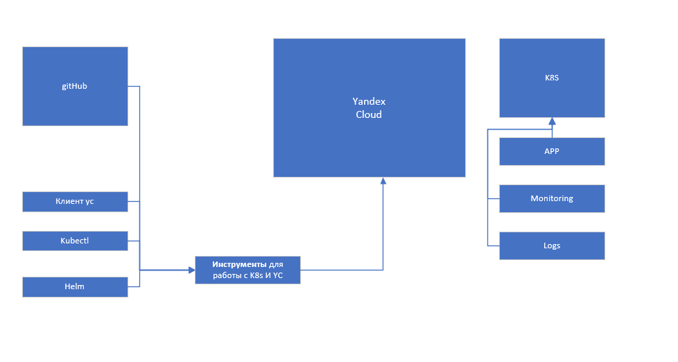
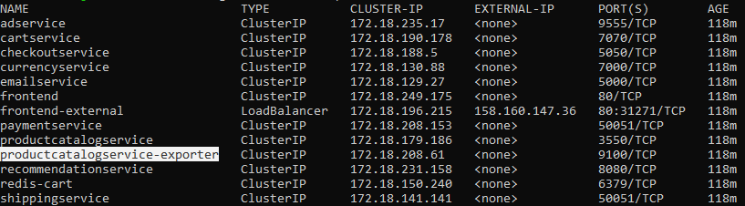
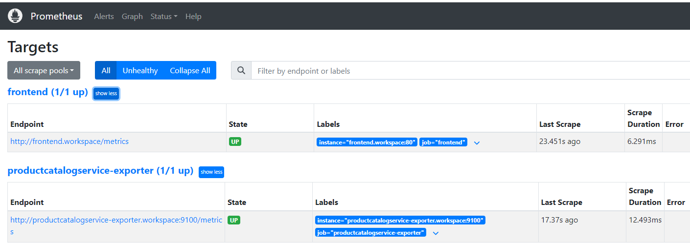
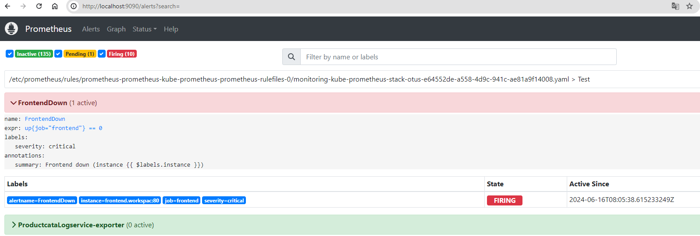
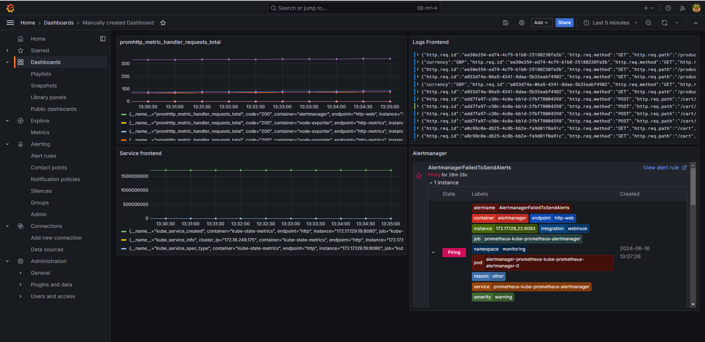

# Мониторинг и логирования MS в кластер k8s(OTUS Monitoring-2024-11)
## Цели проекта:
* Подтвердить знания, полученные при прохождении курса.
* Научиться использовать инструменты: мониторинг, логирование в k8s

## Описание технологий
Проект Online Boutique by Google был взят за основу. Для его реализации используются следующие решения и технологии:
* Кластер развернут в Yandex Cloud для обеспечения надежности и масштабируемости.
* Хранение кода осуществляется на платформе GitHub для эффективного управления версиями и совместной разработки.
* Для мониторинга и логирования используются Prometheus и Loki, установленные с помощью Helm, что обеспечивает прозрачное отслеживание и анализ работы приложения.
* Для управления приложениями в кластере используется утилита kubectl, обеспечивающая удобное управление контейнеризированными приложениями в Kubernetes.
* Для исправления и упрощения ведения документации используется Chad AI

## CI/CD
Код размещен на GitHub. (Для переиспользования требуется огромная переработка, дабы костыли, которые в нем присутствуют стали архитектурным решением!!!)

## MS
* Все сервисы были пересобраны и размещены в приватном репозитории (hub.dicker.com).
* В сервисе frontend был подключен модуль Prometheus для сбора метрик ([Метрики](http://otus.nt33.ru/metrics)). Кроме того, в деплой модуля был добавлен дополнительный объект ServiceMonitor. [Код](project/microservices/src/frontend).
* При сборке сервиса productcatalogservice в Dockerfile была добавлена операция по добавлению prometheus-exporter. [Код](project/microservices/src/productcatalogservice).

## Prometheus (Мониторинг и оповещение)
* Установка выполняется с использованием helm chart от prometheus-community/kube-prometheus-stack, а также конфигурационного файла [prometheus-values.yaml](configs\prometheus-values.yaml).
* Добавлены две дополнительные точки для сбора метрик (описанных в MS) - frontend, productcatalogservice-exporter.
* Созданы два дополнительных правила для отправки уведомлений в AlertManager - FrontendDown, Productcatalogservice-exporter.
* Настроен виртуальный канал для отправки сообщений в Telegram.

## Loki (централизованое хранилище)
Хранение логов настроено на S3 хранилище от Яндекса

## Grafana (Отображение метрик и логов)
* Установка происходила совместно с Loki
* Создан руками (процесс не автоматизирован) примитивные метрики с frontend и productcatalogservicezaz

## Установка и развёртывание приложения
* Было принято решение использовать инструмент kubectl с целью получения начального опыта работы с этой утилитой.
* В процессе настройки сценария развёртывания были внесены изменения для интеграции с Prometheus и настройки системы алертинга.
* Веб-страница http://otus.nt33.ru

## Не успел
* Документация по проекту
* Ведение Changelog
* Отчетливые коммиты, все коммиты отладки обьеденены и "заforceл"
* Внедрить более детальное логирование и трассировку
* Оттестировать все дополнительные сценарии
* Автоматическое создание custom dashboard в Grafana
